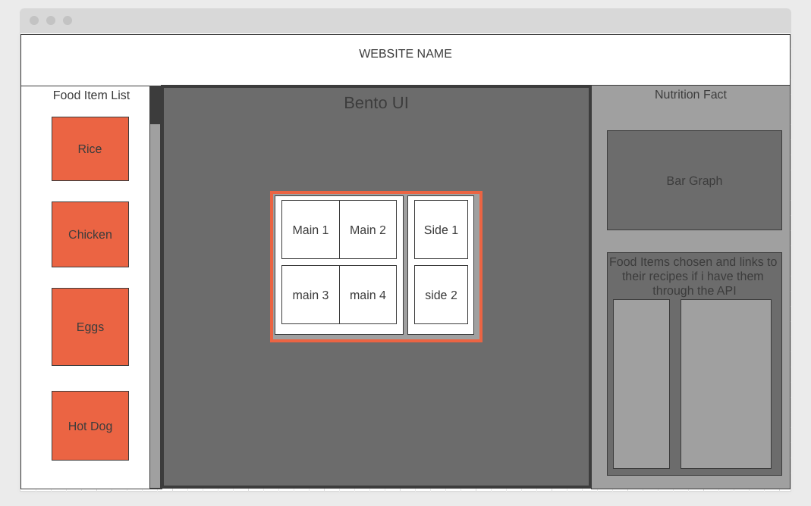

# MPrep

## Background & Overview

- The purpose of my project is to create a simple interface that will help users plan out
their meal preps. 
  1. The current popular ways to help meal prep is to use a phone app
    and scan every single item and have the user manually choose the item through 
    a giant list of items
  2. This solution is slow and very tedious, which causes users to be discouraged 
    to meal prep
  3. My website would allow users tomanually choose 

## Functionality & MVPs
1. The basic functionality of my Website will have the layout of a lunch box on screeen.
  this lunchbox will be sectioned off into parts. 
    - As of right now it would have 2 openings with a (70:30) split because that seems to be the most common type of meal prep lunch box.
2. I currently have planned 5 different food items with pictures while I plan on using a lot more food items with default pictures. 
    - This is due to time constraints and creating drawings for every single food item will be out of scope.
3. Everytime the user adds a item into my lunchbox, my website will show the macros(carb, protein, fats, total calories) on the side so it will let the user know the vital nutrition facts on the lunchbox they are making. 
## Wireframes

  

## Technologies

## Implementation Timeline

