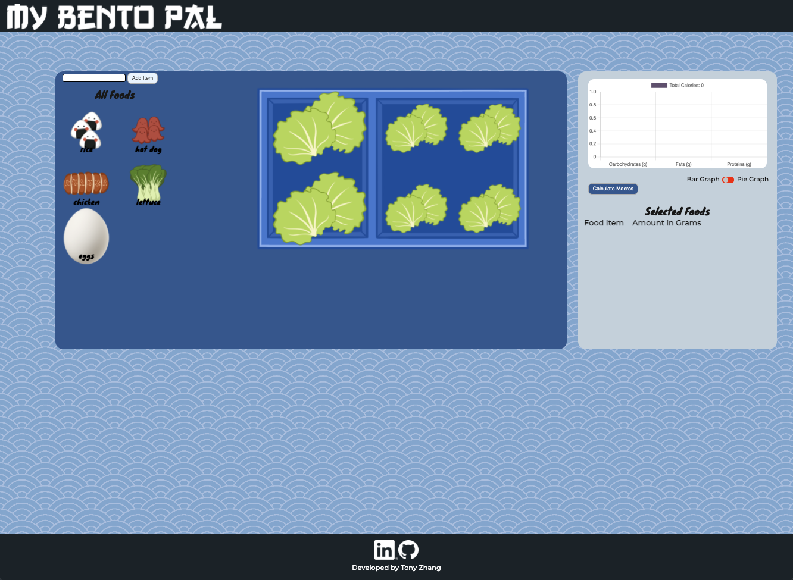

# MPrep
## Live Site
# [MyBentoPal](https://tozhang665.github.io/MyBentoPal/)

## Background & Overview

- The purpose of my project is to create a simple interface that will help users plan out
their meal preps. 
  1. The current popular ways to help meal prep is to use a phone app
    and scan every single item and have the user manually choose the item through 
    a giant list of items
  2. This solution is slow and very tedious, which causes users to be discouraged 
    to meal prep
  3. My website would allow users to manually choose which items to put inside the lunchbox

## Functionality & MVPs
1. The basic functionality of my Website will have the layout of a lunch box on screeen.
  this lunchbox will be sectioned off into parts. 
    - As of right now it would have 2 openings with a (70:30) split because that seems to be the most common type of meal prep lunch box.
2. I currently have planned 5 different food items with pictures while I plan on using a lot more food items with default pictures. 
    - This is due to time constraints and creating drawings for every single food item will be out of scope.
3. Everytime the user adds a item into my lunchbox, my website will show the macros(carb, protein, fats, total calories) on the side so it will let the user know the vital nutrition facts on the lunchbox they are making. 
## Page Layout



## Implementation

### Drag and Drop

Drag and drop features is fairly simple but has proven to be its own challenge. it makes use of having using the "dragstart" , "dragging", and "dragend". 
There is a event listener for all "draggable" elements and would add the class "dragging" if a element is being dragged. Afterwards, It would detect where the cursor will end up and will append the element as needed

```javascript
const draggables = document.querySelectorAll(".draggable")
const containers = document.querySelectorAll(".container")

draggables.forEach(draggable =>{
  draggable.addEventListener('dragstart',()=>{
    draggable.classList.add('dragging');
  })

  draggable.addEventListener('dragend',()=>{
    draggable.classList.remove('dragging');
  })

})

containers.forEach(container =>{
  container.addEventListener('dragover',e=>{
    e.preventDefault();
    const afterElement = getDragAfterElement(container,e.clientY)
    const draggable = document.querySelector(".dragging")
    if(afterElement == null){
      container.appendChild(draggable);
    }else{
      container.insertBefore(draggable,afterElement.element);
    }

  })

})

```


## Technologies
1. HTML
2. CSS
3. JavaScript
4. jQuery/AJAX
5. Edamam API - https://developer.edamam.com/edamam-docs-nutrition-api
6. RapidApi - https://rapidapi.com/spoonacular/api/recipe-food-nutrition/
## Implementation Timeline

* Friday: Start base layout with minimal CSS and flexbox. Start drag and drop features.
* Monday: Finish Drag and drop as well as start designing and implementing graph with being able to add food items.
* Tuesday: finish implementation of graph as well as API calls to nutrition database.
* Wednesday: Final CSS fixes and implementation and stress test features.
* Thursday: bug fixes and finalize product.

